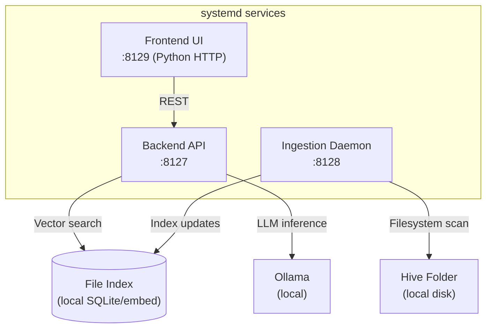
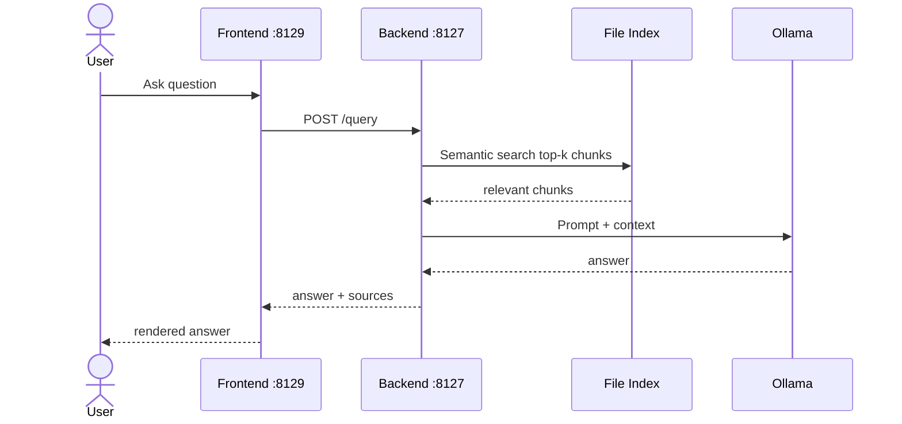
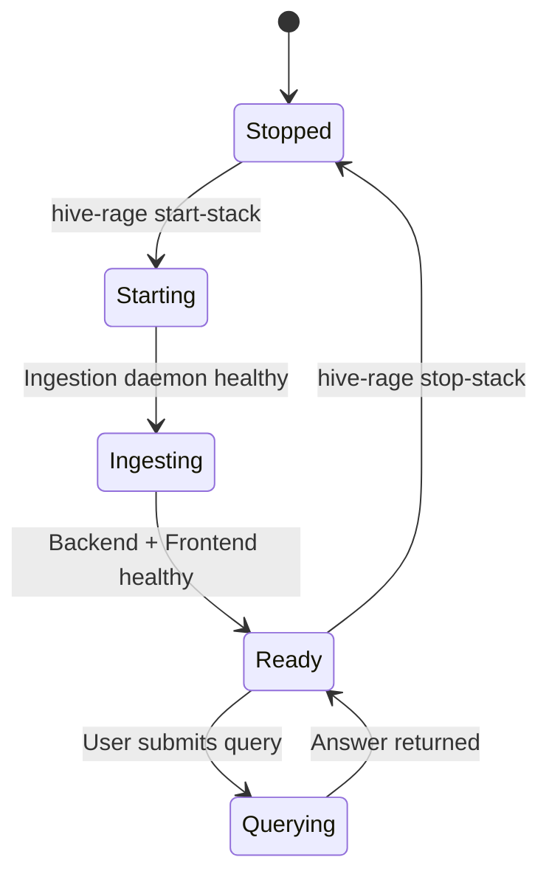

# Hive Rage — Overview

## What This Is
Hive Rage is a three-component local stack that autonomously indexes a designated "hive" folder on a Linux host and answers Ollama-backed natural-language queries against that file corpus. It is designed for always-on, unattended local operation via systemd.

## Who It's For
Power users and home lab operators who want a private, fully local RAG system over a folder of files — without cloud dependencies.

## Problem It Solves
Makes a local folder of files (documents, notes, PDFs) conversationally queryable using a local LLM, with background ingestion keeping the index fresh automatically.

## How It's Used
Start with `hive-rage start-stack`. The ingestion daemon continuously scans the hive folder and updates the index. The backend API serves queries and configuration. The frontend web UI provides a browser-based query and config interface. All three are manageable as systemd services.

## Component Stack

## Data Flow

## Behavioral Model

---
*Generated by github-repo-overview skill · Last updated: 2026-06-09 · Stack: Python HTTP + Ollama + local vector index + systemd*
